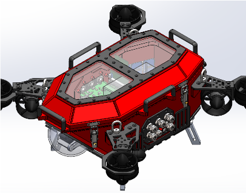

# SDSU Mechatronics 2022

# About contributions

If you are unsure where to start, refer to the Kanban board on Trello or ask Software Project Manager or Software Lead.

Build and environment setup instructions are located in the docs. Refer to them before running `git clone` on this repository!

# About this repo

This repository has required code styling and commit rules. See style guide below for details.

ONLY upload source code. Do NOT commit binaries or Docker containers to this repository.

Pull request to master requirements:
Approved PR in `yourfeaturename-beta` branch from ANY project manager or the software lead is *required*. See below for details.

To begin development on a new feature, it is *recommended* to create a new branch from the `beta` branch, not the `master` branch, naming it `yourfeaturename` or `yourfeaturename-dev` to indicate the branch is in development. When code is ready for submission, code is *required* be merged to a `yourfeaturename-beta` branch where a PR is then submitted, along with linking relevant issues here on GitHub. ***If you do NOT name your branch with the*** `-beta` ***naming convention, it is assumed the code is not ready to be merged and as a result will not be merged***.

Contributions are tracked via Git and GitHub but it is still *recommended* to comment your name and date on files worked on.

[Python installation and setup guide](src/man/python_setup_guide.md)

Python styling guide: All code in Python must follow [our styling guide](src/man/styling_guide.md).

C/C++ styling guide: All C/C++ code must follow the [Linux Kernal styling guide](https://www.kernel.org/doc/html/v4.10/process/coding-style.html).

Git naming conventions and usage: To make your own branches and push to this repository, read [our Git Guide](src/man/git_guide.md).

# About Scion

### Scion is the SDSU Mechatronics robot for the 2022 RoboSub Competition.

